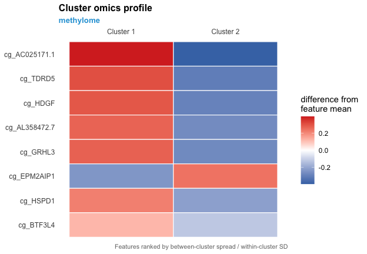

# LUCIDus Version 3: LUCID with Multiple Omics Data

<!-- badges: start -->

[](https://cran.r-project.org/package=LUCIDus)

[](https://image.usc.edu)
<!-- badges: end -->

This repository contains the source code for LUCIDus Version 3.2.1. The
**LUCIDus** package implements the statistical method LUCID originally
proposed in the research paper [A Latent Unknown Clustering Integrating
Multi-Omics Data (LUCID) with Phenotypic
Traits](https://doi.org/10.1093/bioinformatics/btz667)
(*Bioinformatics*, 2020). The original LUCID conducts integrated
clustering by using multi-view data, including genetic or environmental
exposures, single-layer omics data, and with/without outcome.
**LUCIDus** features variable selection, incorporating missingness in
omics data, visualization of the LUCID model via Sankey diagram,
bootstrap inference, and functions for tuning model parameters. The
missing data imputation mechanism was introduced in [An extension of
latent unknown clustering integrating multi-omics data (LUCID)
incorporating incomplete omics
data](https://doi.org/10.1093/bioadv/vbae123)(*Bioinformatics
Advances*,2024). We then extended the single-omic LUCID model to
multi-omics in this research paper [LUCIDus: An R Package For
Implementing Latent Unknown Clustering By Integrating Multi-omics Data
(LUCID) With Phenotypic
Traits](https://journal.r-project.org/articles/RJ-2024-012/)(*R
Journal*,2024).

**LUCID version 3**, a major update and enhancement from the original
release, implements different integration strategies for multi-omics
data with multiple layers, including LUCID early integration (early
integration), LUCID in parallel (intermediate integration), and LUCID in
serial (late integration). The following DAG illustrates the three
different LUCID models for three integration strategies.

<p align="center">


</p>

If you are interested in the integration of omic data to estimate
mediator or latent structures, please check out [Conti
Lab](https://contilab.usc.edu/about/) to learn more.

## Installation

You can install the development version of LUCIDus 3.2.1 from R CRAN
with:

``` r
install.packages("LUCIDus")
```

## Workflow

The following figure illustrates the workflow of LUCIDus 3.2.1.
<p align="center">


</p>

## Usage

Please refer to Section 3 of the [R Journal
article](https://journal.r-project.org/articles/RJ-2024-012/) for a full
workflow illustration with real data.

Below are minimal examples showing the simplest usage of `lucid()` under
**early**, **intermediate**, and **late** integrations.

### Minimal Example: Early Integration

``` r
library(LUCIDus)

set.seed(123)

# Exposure (G): 1 variable
G <- matrix(rnorm(100), ncol = 1)

# Omics data (Z): 5 features
Z <- matrix(rnorm(100 * 5), ncol = 5)

# Outcome (Y): continuous
Y <- rnorm(100)

# Fit LUCID with early integration
fit_early <- lucid(
  G = G,
  Z = Z,
  Y = Y,
  family = "normal",
  K = 2
)

summary(fit_early)
```

### Minimal Example: LUCID in Parallel

``` r
# Exposure
G <- matrix(rnorm(100), ncol = 1)

# Two omics layers (Z1 and Z2)
Z1 <- matrix(rnorm(100 * 4), ncol = 4)
Z2 <- matrix(rnorm(100 * 3), ncol = 3)

Z_list <- list(Z1 = Z1, Z2 = Z2)

# Outcome
Y <- rnorm(100)

fit_parallel <- lucid(
  G = G,
  Z = Z_list,
  Y = Y,
  family = "normal",
  lucid_model = "parallel",
  K = list(2,2)
)

summary(fit_parallel)
```

### Minimal Example: LUCID in Serial

``` r
# Exposure
G <- matrix(rnorm(100), ncol = 1)

# Two omics layers for the serial pathway
Z1 <- matrix(rnorm(100 * 4), ncol = 4)
Z2 <- matrix(rnorm(100 * 3), ncol = 3)

Z_list <- list(Z1 = Z1, Z2 = Z2)

# Outcome
Y <- rnorm(100)

fit_serial <- lucid(
  G = G,
  Z = Z_list,
  Y = Y,
  family = "normal",
  lucid_model = "serial",
  K = list(2,2)
)

summary(fit_serial)
```

## Full Workflow Example: Bundled HELIX Data

The examples above use generic random data to show `lucid()`’s call
signature under each integration strategy. The walkthrough below instead
runs a complete, reproducible example on `simulated_HELIX_data`, the
simulated HELIX-study dataset bundled with the package, fitting a LUCID
**parallel** model – one latent cluster variable per omics layer, fit
jointly – since the omics data here comes as three genuinely distinct
layers (methylome, transcriptome, miRNA).

``` r
library(LUCIDus)

# The bundled HELIX dataset: one exposure (postnatal mercury exposure),
# three omics layers, two covariates, and one outcome (a liver enzyme).
data(simulated_HELIX_data)
d <- simulated_HELIX_data

G <- as.matrix(d$phenotype$hs_hg_m_scaled)
colnames(G) <- "mercury_exposure"

Z <- list(
  methylome     = d$methylome,
  transcriptome = d$transcriptome,
  miRNA         = d$miRNA
)

Co <- data.frame(
  age = d$phenotype$hs_child_age_yrs_None,
  sex = as.numeric(d$phenotype$e3_sex_None == "male")
)

Y <- as.matrix(d$phenotype$ck18_scaled)
colnames(Y) <- "ck18"

fit <- estimate_lucid(
  G = G, Z = Z, Y = Y, CoG = Co, CoY = Co,
  lucid_model = "parallel",
  family = "normal",
  K = c(2, 2, 2),
  seed = 2026
)
#> Fitting LUCID parallel model (3 layers)...
#> Finished LUCID parallel model.

class(fit)
#> [1] "lucid_parallel"
```

`lucid_model = "parallel"` selects the architecture; `K = c(2, 2, 2)`
asks for 2 clusters in each of the three layers (in `Z`’s order).
`CoG`/`CoY` are covariates adjusted for in the exposure-to-cluster and
cluster-to-outcome models respectively – here, the same age/sex
covariates for both.

### Reading the fitted model

``` r
summary(fit)
#> 
#> ====================================================
#> LUCID Parallel: Model Summary
#> ====================================================
#> 
#> Model specification
#>   Family                 : gaussian
#>   Number of observations : 420
#>   Clusters per layer     : 2, 2, 2
#> 
#> Missing-data profile by layer
#>   Layer 1 listwise rows : 0 / 420 (0.0%)
#>   Layer 1 sporadic rows : 0 / 420 (0.0%)
#>   Layer 1 missing cells : 0 / 4200 (0.0%)
#>   Layer 2 listwise rows : 0 / 420 (0.0%)
#>   Layer 2 sporadic rows : 0 / 420 (0.0%)
#>   Layer 2 missing cells : 0 / 4200 (0.0%)
#>   Layer 3 listwise rows : 0 / 420 (0.0%)
#>   Layer 3 sporadic rows : 0 / 420 (0.0%)
#>   Layer 3 missing cells : 0 / 4200 (0.0%)
#> 
#> Feature selection overview
#>   G features selected    : 1 / 1 (100.0%)
#>   G features by layer
#>     Layer 1              : 1 / 1 (100.0%)
#>     Layer 2              : 1 / 1 (100.0%)
#>     Layer 3              : 1 / 1 (100.0%)
#>   Z features
#>     Layer 1 selected     : 10 / 10 (100.0%)
#>     Layer 1 multi-cluster: 10
#>     Layer 2 selected     : 10 / 10 (100.0%)
#>     Layer 2 multi-cluster: 10
#>     Layer 3 selected     : 10 / 10 (100.0%)
#>     Layer 3 multi-cluster: 10
#> 
#> Model fit statistics
#>   Log-likelihood         : -16169.04
#>   BIC                    : 34808.55
#>   Number of parameters   : 409
#> 
#> Regularization
#>   Rho_G                  : 0.000
#>   Rho_Z_Mu               : 0.000
#>   Rho_Z_Cov              : 0.000
#> 
#> Detailed parameter estimates
#> (1) Y (continuous outcome): intercept, effects of each non-reference latent cluster for each layer of Y (and effect of covariates if included) 
#>                   Gamma
#> (Intercept) -0.82350744
#> Layer1_LC2   0.95020537
#> Layer2_LC2   0.19542997
#> Layer3_LC2   0.47724613
#> age         -0.00863345
#> sex          0.02341732
#> 
#> (2) Z: mean of omics data for each latent cluster of each layer 
#> Layer 1
#> 
#>               mu_cluster1 mu_cluster2
#> cg_GRHL3       0.18408265 -0.36284441
#> cg_BTF3L4      0.06723869 -0.17541351
#> cg_AL358472.7  0.17008486 -0.36863454
#> cg_HDGF        0.21746220 -0.36714732
#> cg_TDRD5       0.25376985 -0.36018991
#> cg_CSRNP3      0.08050203 -0.09532648
#> cg_HSPD1       0.17490777 -0.26096784
#> cg_EPM2AIP1   -0.13860873  0.34406638
#> cg_AC025171.1  0.34470233 -0.44257881
#> cg_VTRNA1_3   -0.11214165  0.08113805
#> 
#> Layer 2
#> 
#>                   mu_cluster1 mu_cluster2
#> tc_TC01006069_nc -0.522270317  0.47930061
#> tc_SLC9A4        -0.006309301  0.01450134
#> tc_RAB6C_AS1     -0.041387945 -0.02026131
#> tc_LOC100129029   0.153725322 -0.04718847
#> tc_BRE           -0.088592471  0.10032251
#> tc_TC03001220_nc -0.361877314  0.28246497
#> tc_TC04002114_nc -0.128442683  0.11614619
#> tc_TC04002369_nc -0.375653735  0.52775346
#> tc_BEND4         -0.255524235  0.16054010
#> tc_SLC9A3         0.202163670 -0.03271405
#> 
#> Layer 3
#> 
#>                mu_cluster1  mu_cluster2
#> miR.101.3p     0.031111557  0.064610758
#> miR.125a.5p   -0.153728401  0.079688810
#> miR.125b.1.3p  0.039869641  0.040503869
#> miR.127.3p    -0.415405400  0.314634153
#> miR.140.5p     0.312852637 -0.009306536
#> miR.142.3p    -0.102400018  0.086767597
#> miR.144.5p    -0.005121102  0.027388439
#> miR.19a.3p    -0.276896191  0.165091012
#> miR.19b.3p    -0.126646333  0.128221532
#> miR.21.5p      0.003262879  0.055314865
#> 
#> (3) E: intercept and odds ratio of being assigned to each latent cluster for each exposure for each layer 
#> Layer 1
#> 
#>                                beta        OR
#> (Intercept).cluster2      2.4308007 11.367981
#> mercury_exposure.cluster2 0.9694861  2.636589
#> 
#> Layer 2
#> 
#>                                 beta       OR
#> (Intercept).cluster2      -1.0848810 0.337942
#> mercury_exposure.cluster2  0.4478715 1.564978
#> 
#> Layer 3
#> 
#>                                 beta        OR
#> (Intercept).cluster2      -0.1489437 0.8616176
#> mercury_exposure.cluster2 -0.0522552 0.9490866
```

`summary()` reports, per layer: the model specification, the exposure’s
effect on cluster membership (as a log-odds/odds ratio), and each
cluster’s mean omics profile. Two extractor functions read the same
information programmatically, auto-detecting that `fit` is a parallel
model with no further input:

``` r
# Each subject's hard cluster assignment, one vector per layer.
str(get_cluster_assignment(fit))
#> List of 3
#>  $ : num [1:420] 1 1 1 2 1 1 1 1 2 2 ...
#>  $ : num [1:420] 2 2 2 1 2 1 2 2 2 2 ...
#>  $ : num [1:420] 2 1 2 1 2 1 1 1 2 2 ...

# The 5 omics features that most separate the clusters, one layer's worth.
get_top_omics_features(fit, top_n = 5)[["methylome"]]
#> cg_AC025171.1      cg_TDRD5       cg_HDGF cg_AL358472.7      cg_GRHL3 
#>     0.5750393     0.4513173     0.4322713     0.3922378     0.3803111
```

### Visualizing the clusters’ omics profiles

`plot_cluster_omic_profile()` shows which omics features distinguish the
clusters, and in which direction – one figure per layer for a parallel
fit:

``` r
plot_cluster_omic_profile(fit, top_n = 8)[["methylome"]]
```

<!-- -->

## Vignettes

Once installed, every vignette below is available with
`vignette("<name>")`. Rendered copies are also in [`docs/`](docs/) in
this repository, viewable directly in a browser without installing the
package:

- [`lucid_3models_normal_outcome`](https://htmlpreview.github.io/?https://github.com/ContiLab-usc/LUCIDus-3.0/blob/main/docs/lucid_3models_normal_outcome.html)
  – a full early/parallel/serial walkthrough, including feature
  selection and bootstrap inference, for a **continuous** outcome.
- [`lucid_3models_binary_outcome`](https://htmlpreview.github.io/?https://github.com/ContiLab-usc/LUCIDus-3.0/blob/main/docs/lucid_3models_binary_outcome.html)
  – the same walkthrough for a **binary** outcome.
- [`lucidus_full_functionality_guide`](https://htmlpreview.github.io/?https://github.com/ContiLab-usc/LUCIDus-3.0/blob/main/docs/lucidus_full_functionality_guide.html)
  – a breadth-first tour of every exported function.


## Citation

If you use **LUCIDus**, please cite the following papers:

------------------------------------------------------------------------

### **1. Original LUCID Method**

Peng C., Wang J., Asante I., Louie S., Jin R., Chatzi L., Casey G.,
Thomas D.C., Conti D.V. (2019). **A latent unknown clustering
integrating multi-omics data (LUCID) with phenotypic traits.**
*Bioinformatics*, btz667.
<https://doi.org/10.1093/bioinformatics/btz667>

------------------------------------------------------------------------

### **2. LUCIDus Package (R Journal Article for the Extension to Multi-omics)**

Zhao Y., Jia Q., Goodrich J.A., Conti D.V. (2024). **LUCIDus: An R
Package for Implementing Latent Unknown Clustering by Integrating
Multi-omics Data (LUCID) With Phenotypic Traits.** *R Journal*, 16(2),
2024. <https://journal.r-project.org/articles/RJ-2024-012/>

------------------------------------------------------------------------

### **3. LUCID with Missing-Data Imputation (If the Missing Data Imputation Mechanism is Applied)**

Zhao Y., Jia Q., Goodrich J., Darst B., Conti D.V. (2024). **An
extension of latent unknown clustering integrating multi-omics data
(LUCID) incorporating incomplete omics data.** *Bioinformatics
Advances*, 4(1), vbae123. <https://doi.org/10.1093/bioadv/vbae123>
